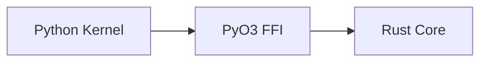

# WarmLogic Documentation Style Guide

> **Version**: 1.0
> **Last Updated**: 2026-02-07

This guide ensures consistency across all WarmLogic documentation.

---

## Language and Tone

### General Principles

- **Be precise**: Avoid vague terms like "many", "some", "very". Use specific numbers and measurements.
- **Be honest**: Document limitations clearly. Never hide known issues; grade claims in docs/CLAIM_EVIDENCE.md.
- **Be direct**: Use active voice. Avoid passive constructions when possible.
- **Be inclusive**: Write for an international audience. Avoid idioms and cultural references.

### Technical Writing

- Use present tense for current behavior: "The kernel rejects invalid signatures."
- Use future tense for planned features: "Version 2.0 will add TPM integration."
- Define acronyms on first use: "Post-Quantum Cryptography (PQC)"

---

## Document Structure

### Required Headers

Every technical document must include:

```markdown
# Document Title

> **Version**: X.Y
> **Status**: [Draft | Active | Deprecated]
> **Last Updated**: YYYY-MM-DD
```

### Korean Translations

Korean documents use the same header block, with the field labels and the status
values written in Korean, plus one extra field linking back to the English original:

```markdown
# Document title

> **Version**: X.Y
> **Status**: [Draft | Active | Deprecated]
> **Original**: ORIGINAL.md
> **Last Updated**: YYYY-MM-DD
```

---

## Code Examples

### Language Tagging

Always specify the language in fenced code blocks:

```python
# Good
from warm_logic.sdk import SovereignClient
```

```bash
# Good
pip install warmlogic
```

### Runnable Examples

- All code examples in documentation MUST be tested by CI
- Use `tests/docs/` for documentation example tests
- Mark untested examples with a warning:

```markdown
> ⚠️ **Untested Example**: This code has not been verified.
```


## File Naming

| Type | Pattern | Example |
|------|---------|---------|
| English doc | `UPPERCASE.md` | `ARCHITECTURE.md` |
| Korean doc | `UPPERCASE_ko.md` | `ARCHITECTURE_ko.md` |
| Subdirectory | `lowercase/` | `business/`, `dev/` |

---

## Links and References

### Internal Links

- Use relative paths: `API Reference`
- For subdirectory links: `Quickstart`
- Never use absolute paths: ❌ `/Users/name/docs/FILE.md`

### External Links

- Use HTTPS: `https://example.com`
- Add descriptive text: `[ML-DSA-65 Specification](https://...)`
- For GitHub links, prefer permanent URLs with commit hashes for code references

### Cross-References

When referencing other documents, use the standard format:

```markdown
See THREAT_MODEL.md for security details.
```

---

## Tables

### Alignment

- Use colons for alignment:

```markdown
| Left | Center | Right |
|:-----|:------:|------:|
| text | text   | text  |
```

### Consistency

- Keep column widths visually consistent
- Use sentence case for headers
- Avoid mixing code and prose in the same column

---

## Versioning

### Version Numbers

- Use Semantic Versioning: `MAJOR.MINOR.PATCH`
- Pre-release versions: `1.0.0-rc1`, `1.0.0-beta`
- Document versions independently from code versions

### Update Dates

- Use ISO 8601 format: `2026-02-07`
- Update the "Last Updated" field on every meaningful change

---

## Diagrams

### ASCII Art

Preferred for simple diagrams:

```
┌─────────┐     ┌─────────┐
│ Python  │────▶│  Rust   │
└─────────┘     └─────────┘
```

### Mermaid

For complex diagrams, use Mermaid (GitHub renders natively):



---

## Glossary

Define technical terms in `GLOSSARY.md` and `GLOSSARY_ko.md`. Link to glossary entries on first use:

```markdown
The system uses PQC signatures.
```

---

## Localization

### Korean Style

- Use the formal polite speech level (hapsyo-che), i.e. the `-hamnida` / `-imnida` endings
- Translate technical terms consistently (see GLOSSARY_ko.md)
- Keep code examples in English
- Translate comments only when necessary for understanding

### Bilingual Documents

For documents needing both languages, create separate files:
- `DOCUMENT.md` (English)
- `DOCUMENT_ko.md` (Korean with link to original)

---

## Review Checklist

Before submitting documentation changes:

- [ ] Claims are graded in docs/CLAIM_EVIDENCE.md
- [ ] Version numbers match VERSION file
- [ ] All code examples are tested
- [ ] Links are valid (run `make link-check`)
- [ ] Korean translations are synchronized
- [ ] Dates are updated to today

---

*Last updated: 2026-02-07*
